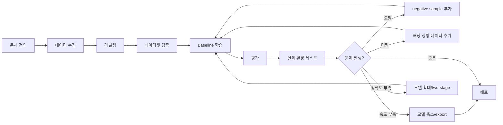

# 00. YOLO 파인튜닝 전체 개념과 진행 방식

## 1. YOLO 파인튜닝이란?

YOLO 파인튜닝은 이미 학습된 YOLO 모델을 내 데이터셋에 맞게 다시 학습시키는 과정이다.

완전히 처음부터 학습하는 것이 아니다.

```text
처음부터 학습:
    랜덤 가중치에서 시작
    많은 데이터와 GPU 필요

파인튜닝:
    COCO 등 대규모 데이터셋으로 학습된 가중치에서 시작
    내 데이터셋에 맞게 추가 학습
```

실제 프로젝트에서는 대부분 파인튜닝을 쓴다.

---

## 2. YOLO가 하는 일

YOLO detection 모델은 이미지에서 물체 위치와 클래스를 동시에 예측한다.

```text
입력:
    이미지

출력:
    class id
    class name
    bounding box
    confidence score
```

예시:

```text
red_led  0.91  [x1, y1, x2, y2]
button   0.83  [x1, y1, x2, y2]
```

---

## 3. 전체 구조

YOLO는 보통 아래처럼 이해하면 된다.

```text
Input Image
    ↓
Backbone
    ↓
Neck
    ↓
Head
    ↓
Detection Result
```

### Backbone

이미지에서 기본 특징을 뽑는다.

```text
초기 layer:
    선, 점, 모서리, 색 변화

중간 layer:
    질감, 패턴, 부분 형태

깊은 layer:
    물체의 큰 구조, 부품 조합, 의미 있는 형태
```

### Neck

Backbone에서 나온 여러 크기의 feature map을 섞는다.

```text
작은 물체를 위한 세밀한 정보
큰 물체를 위한 의미 정보
중간 크기 물체를 위한 복합 정보
```

### Head

최종 결과를 예측한다.

```text
box 좌표
class 확률
confidence
```

내 데이터셋의 클래스 개수가 달라지면 Head 쪽은 새 데이터셋에 맞게 바뀌거나 재학습된다.

---

## 4. 실제 프로젝트에서 중요한 판단

YOLO 파인튜닝은 단순히 명령어 하나로 끝나는 작업이 아니다.

다음 판단을 계속 해야 한다.

```text
데이터가 충분한가?
라벨 품질이 좋은가?
COCO와 비슷한 일반 이미지인가?
아니면 특수 도메인인가?
작은 물체가 많은가?
실시간성이 중요한가?
배포 장비가 라즈베리파이인가, Jetson인가, 서버 GPU인가?
상업적으로 쓸 것인가?
```

---

## 5. 전체 프로젝트 단계



---

## 6. 초보자가 가장 많이 하는 실수

### 실수 1. 모델부터 바꿈

성능이 낮으면 바로 `yolo26m.pt`, `yolo26l.pt`로 바꾸는 경우가 있다.

하지만 대부분의 문제는 모델이 아니라 데이터다.

```text
라벨이 틀림
train/val 분할이 이상함
실제 환경과 데이터셋이 다름
작은 물체가 너무 작게 찍힘
조명/각도 다양성이 없음
```

### 실수 2. train 성능만 봄

중요한 것은 train loss가 아니다.

```text
val mAP
val precision
val recall
실제 카메라 테스트
배포 장비 FPS
오탐/미탐 유형
```

### 실수 3. freeze를 무조건 좋은 것으로 생각함

freeze는 도구일 뿐이다.

```text
데이터가 적고 COCO와 비슷하면 freeze가 유리할 수 있음
도메인이 완전히 다르면 freeze가 불리할 수 있음
데이터가 충분하면 전체 학습이 더 좋을 수 있음
```

---

## 7. 권장 실험 세트

처음 프로젝트에서는 아래 3개를 기본으로 돌린다.

```text
exp01_baseline
    pretrained 모델 전체 fine-tuning

exp02_freeze10
    backbone 일부 freeze

exp03_two_stage
    stage1 freeze
    stage2 unfreeze + low lr
```

비교 기준:

```text
mAP50
mAP50-95
Precision
Recall
실제 이미지 추론 결과
FPS
모델 크기
오탐/미탐 패턴
```

---

## 8. 한 줄 결론

YOLO 파인튜닝에서 가장 중요한 순서는 아래다.

```text
데이터 품질 > 라벨 품질 > train/val 분리 > 적절한 모델 크기 > freeze 전략 > 하이퍼파라미터
```
