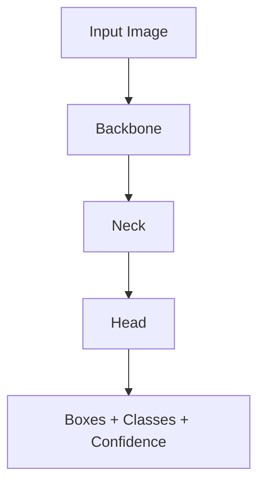

# 03. 학습 전략: Backbone, Neck, Head, Freeze, Two-stage

## 1. YOLO 구조 다시 정리

YOLO는 크게 3부분으로 이해하면 된다.

```text
Backbone:
    이미지의 기본 특징을 추출

Neck:
    여러 크기의 특징을 결합

Head:
    최종 box/class/confidence 예측
```

그림으로 보면 아래와 같다.



---

## 2. Backbone

Backbone은 feature extractor다.

```text
초기 layer:
    선, 모서리, 색 변화

중간 layer:
    패턴, 질감, 부분 형태

깊은 layer:
    물체의 의미 있는 구조
```

pretrained 모델의 Backbone은 이미 COCO 같은 데이터셋에서 많은 일반 시각 특징을 배웠다.

그래서 데이터가 적고 일반 RGB 이미지라면 Backbone을 어느 정도 보존하는 게 좋을 때가 있다.

---

## 3. Neck

Neck은 여러 크기의 feature를 섞는다.

객체 크기가 다양하기 때문이다.

```text
작은 객체:
    세밀한 위치 정보 중요

큰 객체:
    의미 정보 중요

중간 객체:
    위치와 의미 둘 다 중요
```

Neck은 작은 객체와 큰 객체를 모두 잘 찾도록 도와준다.

---

## 4. Head

Head는 최종 예측부다.

```text
box 위치
class score
confidence
```

내 데이터셋의 클래스가 pretrained 모델과 다르면 Head는 반드시 새 데이터셋에 맞게 조정되어야 한다.

예:

```text
COCO:
    80 classes

내 데이터셋:
    red_led, blue_led, button
    3 classes
```

이 경우 마지막 출력 구조는 내 클래스 수에 맞게 바뀐다.

---

## 5. Freeze란?

Freeze는 특정 layer의 weight를 학습 중에 업데이트하지 않는다는 뜻이다.

```text
forward:
    계산에 참여함

backward:
    weight 업데이트 안 함
```

즉, freeze한다고 layer가 사라지는 것이 아니다.

```text
Backbone freeze:
    Backbone은 이미지 feature를 계산한다.
    하지만 weight는 바뀌지 않는다.
```

PyTorch 개념으로는 아래와 유사하다.

```python
for param in backbone.parameters():
    param.requires_grad = False
```

---

## 6. 왜 freeze를 쓰는가?

### 이유 1. 데이터가 적을 때 과적합을 줄임

데이터가 적으면 전체 모델이 훈련 이미지를 외울 수 있다.

증상:

```text
train loss는 낮음
val mAP는 낮음
실제 카메라에서 못 잡음
```

freeze를 걸면 학습 가능한 파라미터가 줄어 과적합 위험이 줄 수 있다.

### 이유 2. 학습 속도와 메모리 절약

업데이트할 파라미터가 줄어든다.

```text
학습 속도 증가 가능
GPU 메모리 감소 가능
작은 데이터셋에서 안정화 가능
```

### 이유 3. pretrained feature 보존

pretrained Backbone은 이미 일반적인 시각 특징을 배웠다.

작은 데이터셋으로 전체를 강하게 학습하면 기존 지식이 망가질 수 있다.

---

## 7. freeze가 항상 좋은 것은 아니다

도메인이 COCO와 많이 다르면 Backbone도 적응해야 한다.

예:

```text
열화상
의료 영상
현미경 이미지
위성 이미지
공장 특수 카메라
흑백 센서 이미지
IR 이미지
```

이런 경우 Backbone을 얼리면 오히려 성능이 막힐 수 있다.

---

## 8. 전략 1: 기본 전체 fine-tuning

가장 먼저 해야 하는 baseline이다.

```bash
yolo detect train \
  model=yolo26n.pt \
  data=data.yaml \
  epochs=100 \
  imgsz=640 \
  batch=16 \
  device=0 \
  name=exp01_baseline
```

특징:

```text
Backbone 학습됨
Neck 학습됨
Head 학습됨
```

장점:

```text
모델 전체가 내 데이터에 적응
도메인이 달라도 적응 가능
최종 성능이 높을 수 있음
```

단점:

```text
데이터 적으면 과적합 가능
학습 시간 증가
pretrained feature가 망가질 수 있음
```

추천 상황:

```text
데이터가 충분함
도메인이 pretrained 데이터와 다름
최종 성능이 중요함
```

---

## 9. 전략 2: freeze=10

일반적으로 많이 쓰는 transfer learning 방식이다.

```bash
yolo detect train \
  model=yolo26n.pt \
  data=data.yaml \
  epochs=100 \
  imgsz=640 \
  batch=16 \
  device=0 \
  freeze=10 \
  name=exp02_freeze10
```

의미:

```text
앞쪽 10개 layer를 freeze
보통 Backbone 일부를 보존
뒤쪽 Neck/Head 중심으로 학습
```

장점:

```text
작은 데이터셋에서 안정적
과적합 감소 가능
학습 비용 감소 가능
```

단점:

```text
특수 도메인에서는 적응력 부족
너무 많이 얼리면 성능 한계
```

추천 상황:

```text
데이터가 적음
일반 RGB 이미지
COCO와 비슷한 물체/장면
```

---

## 10. 전략 3: freeze를 더 많이 주기

데이터가 매우 적을 때 고려한다.

```bash
yolo detect train \
  model=yolo26n.pt \
  data=data.yaml \
  epochs=50 \
  imgsz=640 \
  batch=8 \
  device=0 \
  freeze=20 \
  name=exp03_freeze20
```

주의:

```text
너무 많이 freeze하면 Head만 억지로 적응하는 형태가 된다.
내 도메인 특징을 Backbone이 못 배우면 성능이 막힌다.
```

데이터가 30~100장 수준이라면 임시로 시도할 수 있지만, 근본 해결은 데이터 추가다.

---

## 11. 전략 4: 특정 layer만 freeze

Python API에서 명확하게 관리할 수 있다.

```python
from ultralytics import YOLO

model = YOLO("yolo26n.pt")

model.train(
    data="data.yaml",
    epochs=50,
    imgsz=640,
    batch=16,
    device=0,
    freeze=[0, 1, 2, 3, 4],
    name="freeze_specific_layers",
)
```

layer index를 확인하려면:

```python
from ultralytics import YOLO

model = YOLO("yolo26n.pt")

for i, layer in enumerate(model.model.model):
    print(i, layer)
```

버전과 모델 구조에 따라 layer index 의미가 달라질 수 있으므로 직접 출력해서 확인해야 한다.

---

## 12. 전략 5: Two-stage fine-tuning

실전에서 가장 균형 좋은 방식 중 하나다.

```text
Stage 1:
    Backbone 일부 freeze
    Head/Neck을 내 데이터셋에 적응

Stage 2:
    전체 unfreeze
    낮은 learning rate로 전체 미세 조정
```

### Stage 1

```bash
yolo detect train \
  model=yolo26n.pt \
  data=data.yaml \
  epochs=30 \
  imgsz=640 \
  batch=16 \
  device=0 \
  freeze=10 \
  name=stage1_freeze10
```

### Stage 2

```bash
yolo detect train \
  model=runs/detect/stage1_freeze10/weights/best.pt \
  data=data.yaml \
  epochs=50 \
  imgsz=640 \
  batch=16 \
  device=0 \
  lr0=0.001 \
  name=stage2_unfreeze_low_lr
```

장점:

```text
초기 학습 안정적
Head가 먼저 적응
이후 전체 모델이 조금씩 내 도메인에 적응
```

단점:

```text
학습을 두 번 돌려야 함
실험 관리 필요
```

추천 상황:

```text
데이터가 아주 많지는 않음
성능을 더 끌어올리고 싶음
기본 학습이 불안정함
```

---

## 13. 전략 6: 작은 객체 중심 학습

작은 객체를 못 찾는다면 freeze보다 먼저 확인할 것이 있다.

```text
imgsz가 충분한가?
라벨 박스가 정확한가?
객체가 너무 작게 찍히지 않았는가?
원본 해상도가 낮지 않은가?
```

명령어:

```bash
yolo detect train \
  model=yolo26s.pt \
  data=data.yaml \
  epochs=100 \
  imgsz=960 \
  batch=8 \
  device=0 \
  name=small_object_img960
```

작은 객체에서는 모델 크기보다 해상도와 데이터 품질이 더 중요할 때가 많다.

---

## 14. 전략 7: 실시간 배포 중심 학습

라즈베리파이, 로봇, 온디바이스에서 돌릴 거면 정확도만 보면 안 된다.

```text
모델 크기
FPS
latency
CPU/GPU 사용량
메모리 사용량
전력
```

추천:

```bash
yolo detect train \
  model=yolo26n.pt \
  data=data.yaml \
  epochs=100 \
  imgsz=640 \
  batch=16 \
  device=0 \
  name=edge_yolo_n
```

추론이 느리면:

```text
yolo26n 사용
imgsz 640 -> 416 또는 320
ONNX export
TensorRT/OpenVINO 사용
confidence threshold 조정
후처리 최적화
```

---

## 15. 데이터 상황별 추천표

| 상황 | 추천 전략 |
|---|---|
| 데이터 많음, 일반 RGB | baseline full fine-tuning |
| 데이터 적음, 일반 RGB | freeze=10 |
| 데이터 매우 적음 | freeze=10 또는 20, 하지만 데이터 추가가 우선 |
| 도메인 특수함 | full fine-tuning 또는 two-stage 후 unfreeze |
| 작은 객체 많음 | imgsz 증가, 라벨 품질 개선 |
| 실시간 중요 | n 모델, 작은 imgsz, export 최적화 |
| train 좋고 val 나쁨 | freeze, augmentation, 데이터 분리 재검토 |
| val 좋고 실제 안 됨 | 실제 환경 데이터 추가 |

---

## 16. 초보자 최종 권장 실험

아래 4개를 같은 데이터셋으로 비교한다.

```bash
# 1. baseline
yolo detect train model=yolo26n.pt data=data.yaml epochs=100 imgsz=640 name=exp01_baseline

# 2. freeze10
yolo detect train model=yolo26n.pt data=data.yaml epochs=100 imgsz=640 freeze=10 name=exp02_freeze10

# 3. two-stage stage1
yolo detect train model=yolo26n.pt data=data.yaml epochs=30 imgsz=640 freeze=10 name=exp03_stage1

# 4. two-stage stage2
yolo detect train model=runs/detect/exp03_stage1/weights/best.pt data=data.yaml epochs=50 imgsz=640 lr0=0.001 name=exp03_stage2
```

그 다음 `best.pt`를 실제 이미지와 카메라에서 비교한다.

---

## 17. 결론

```text
처음:
    baseline부터 만든다.

데이터 적음:
    freeze=10 비교한다.

성능 더 필요:
    two-stage를 한다.

도메인 특수:
    full fine-tuning 또는 stage2 unfreeze가 필요하다.

작은 객체:
    freeze보다 imgsz, 라벨, 촬영 거리부터 본다.

배포:
    정확도와 FPS를 같이 본다.
```
