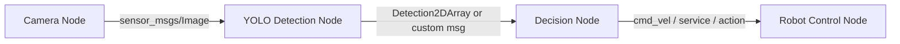
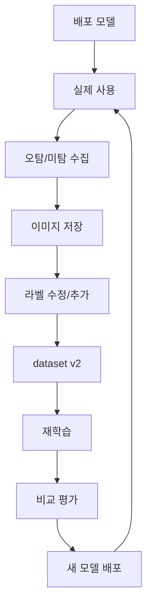

# 05. 추론, Export, 배포 파이프라인

## 1. 학습 후 가장 중요한 파일

학습이 끝나면 보통 아래 파일을 본다.

```text
runs/detect/실험이름/weights/best.pt
runs/detect/실험이름/weights/last.pt
```

권장:

```text
best.pt:
    검증 성능이 가장 좋았던 모델
    보통 추론/배포에 사용

last.pt:
    마지막 epoch 모델
    추가 학습 resume 등에 사용
```

---

## 2. 이미지 추론

```bash
yolo detect predict \
  model=runs/detect/exp03_stage2/weights/best.pt \
  source=test_images/test1.jpg \
  imgsz=640 \
  conf=0.25 \
  save=True
```

폴더 전체 추론:

```bash
yolo detect predict \
  model=runs/detect/exp03_stage2/weights/best.pt \
  source=test_images/ \
  imgsz=640 \
  conf=0.25 \
  save=True \
  name=predict_test_images
```

---

## 3. 웹캠 추론

```bash
yolo detect predict \
  model=runs/detect/exp03_stage2/weights/best.pt \
  source=0 \
  imgsz=640 \
  conf=0.25 \
  show=True
```

카메라가 여러 개면 source를 바꾼다.

```text
source=0
source=1
source=2
```

---

## 4. 비디오 추론

```bash
yolo detect predict \
  model=runs/detect/exp03_stage2/weights/best.pt \
  source=input_video.mp4 \
  imgsz=640 \
  conf=0.25 \
  save=True
```

---

## 5. Python 추론 코드

```python
from ultralytics import YOLO

model = YOLO("runs/detect/exp03_stage2/weights/best.pt")

results = model.predict(
    source="test_images/test1.jpg",
    imgsz=640,
    conf=0.25,
    save=True,
)

for result in results:
    boxes = result.boxes

    for box in boxes:
        cls_id = int(box.cls[0])
        conf = float(box.conf[0])
        xyxy = box.xyxy[0].tolist()

        print(cls_id, conf, xyxy)
```

---

## 6. OpenCV 웹캠 코드 예시

```python
import cv2
from ultralytics import YOLO

model = YOLO("runs/detect/exp03_stage2/weights/best.pt")

cap = cv2.VideoCapture(0)

if not cap.isOpened():
    raise RuntimeError("camera open failed")

while True:
    ret, frame = cap.read()
    if not ret:
        break

    results = model.predict(
        source=frame,
        imgsz=640,
        conf=0.25,
        verbose=False,
    )

    annotated = results[0].plot()

    cv2.imshow("YOLO", annotated)

    if cv2.waitKey(1) == 27:
        break

cap.release()
cv2.destroyAllWindows()
```

---

## 7. ROS 2와 연결하는 개념

ROS 2에서는 보통 이런 구조로 쓴다.

```text
camera node
    ↓ /image_raw
yolo detection node
    ↓ /detections
robot logic node
    ↓ /cmd_vel or service/action
actuator node
```

Mermaid:



YOLO는 단독 프로그램으로도 쓸 수 있지만, 로봇에서는 보통 detection 결과를 topic으로 발행한다.

---

## 8. Export가 필요한 이유

`.pt`는 PyTorch 모델이다.

학습과 실험에는 편하지만, 배포에서는 더 빠르고 호환성 좋은 포맷이 필요할 수 있다.

대표 포맷:

```text
ONNX:
    범용성 좋음
    다양한 런타임에서 사용 가능

TensorRT engine:
    NVIDIA GPU/Jetson에서 빠름

OpenVINO:
    Intel CPU/iGPU/NPU 쪽에 유리

CoreML:
    Apple 생태계

TFLite:
    모바일/엣지 장비
```

---

## 9. ONNX export

```bash
yolo export \
  model=runs/detect/exp03_stage2/weights/best.pt \
  format=onnx \
  imgsz=640
```

Python:

```python
from ultralytics import YOLO

model = YOLO("runs/detect/exp03_stage2/weights/best.pt")
model.export(format="onnx", imgsz=640)
```

결과 예:

```text
runs/detect/exp03_stage2/weights/best.onnx
```

---

## 10. TensorRT export

NVIDIA GPU 또는 Jetson에서 사용한다.

```bash
yolo export \
  model=runs/detect/exp03_stage2/weights/best.pt \
  format=engine \
  imgsz=640 \
  device=0
```

주의:

```text
TensorRT engine은 보통 생성한 환경과 실행 환경 의존성이 크다.
Jetson에서 쓸 engine은 Jetson에서 export하는 것이 안전하다.
```

---

## 11. OpenVINO export

Intel 계열에서 고려할 수 있다.

```bash
yolo export \
  model=runs/detect/exp03_stage2/weights/best.pt \
  format=openvino \
  imgsz=640
```

---

## 12. 배포 장비별 추천

### PC GPU

```text
.pt 그대로 사용 가능
ONNX 가능
TensorRT 가능
```

추천:

```text
정확도 중심이면 .pt
속도 중심이면 TensorRT
```

### Jetson

```text
TensorRT engine 추천
전력/발열/FPS 확인 필요
```

추천:

```text
yolo26n 또는 yolo26s
imgsz 640부터 시작
FPS 부족하면 416/320
```

### 라즈베리파이

```text
CPU 추론은 느릴 수 있음
n 모델 사용
imgsz 낮추기
ONNX Runtime, NCNN, TFLite 등 고려
```

추천:

```text
yolo26n
imgsz 320~640
실시간이 꼭 필요하면 하드웨어 가속기 고려
```

### x86 Mini PC

```text
CPU만 있으면 ONNX/OpenVINO 고려
Intel GPU/NPU가 있으면 OpenVINO 고려
```

---

## 13. 속도 측정

단순히 돌아가는 것과 실시간으로 쓸 수 있는 것은 다르다.

확인할 것:

```text
평균 FPS
최소 FPS
latency
CPU 사용률
GPU 사용률
메모리 사용량
발열
장시간 안정성
```

웹캠에서 대략 FPS 보는 코드:

```python
import time
import cv2
from ultralytics import YOLO

model = YOLO("best.pt")
cap = cv2.VideoCapture(0)

prev = time.time()

while True:
    ret, frame = cap.read()
    if not ret:
        break

    results = model.predict(frame, imgsz=640, conf=0.25, verbose=False)

    now = time.time()
    fps = 1.0 / (now - prev)
    prev = now

    annotated = results[0].plot()
    cv2.putText(
        annotated,
        f"FPS: {fps:.1f}",
        (20, 40),
        cv2.FONT_HERSHEY_SIMPLEX,
        1.0,
        (0, 255, 0),
        2,
    )

    cv2.imshow("YOLO FPS", annotated)

    if cv2.waitKey(1) == 27:
        break

cap.release()
cv2.destroyAllWindows()
```

---

## 14. conf와 iou 조정

추론 시 자주 조정하는 값:

```bash
yolo detect predict \
  model=best.pt \
  source=0 \
  conf=0.25 \
  iou=0.7
```

`conf`:

```text
검출 신뢰도 기준
낮추면 많이 잡음
높이면 확실한 것만 잡음
```

`iou`:

```text
NMS에서 박스를 합칠 때 기준
중복 박스 처리에 영향
```

---

## 15. 배포 전 체크리스트

```text
[ ] best.pt 추론 확인
[ ] test 이미지 폴더 추론 확인
[ ] 실제 카메라 추론 확인
[ ] conf threshold 결정
[ ] 모델 FPS 측정
[ ] 장시간 실행 테스트
[ ] export 포맷 결정
[ ] 배포 장비에서 직접 실행
[ ] 오탐/미탐 위험도 점검
[ ] 라이선스 조건 확인
```

---

## 16. 실전 운영 루프

배포 후에도 데이터 루프가 계속된다.



---

## 17. 결론

배포 관점에서는 아래가 핵심이다.

```text
학습 성능만 보지 않는다.
실제 장비에서 FPS를 본다.
ONNX/TensorRT/OpenVINO 등 export를 고려한다.
오탐/미탐 이미지를 계속 수집해 데이터셋을 개선한다.
```
