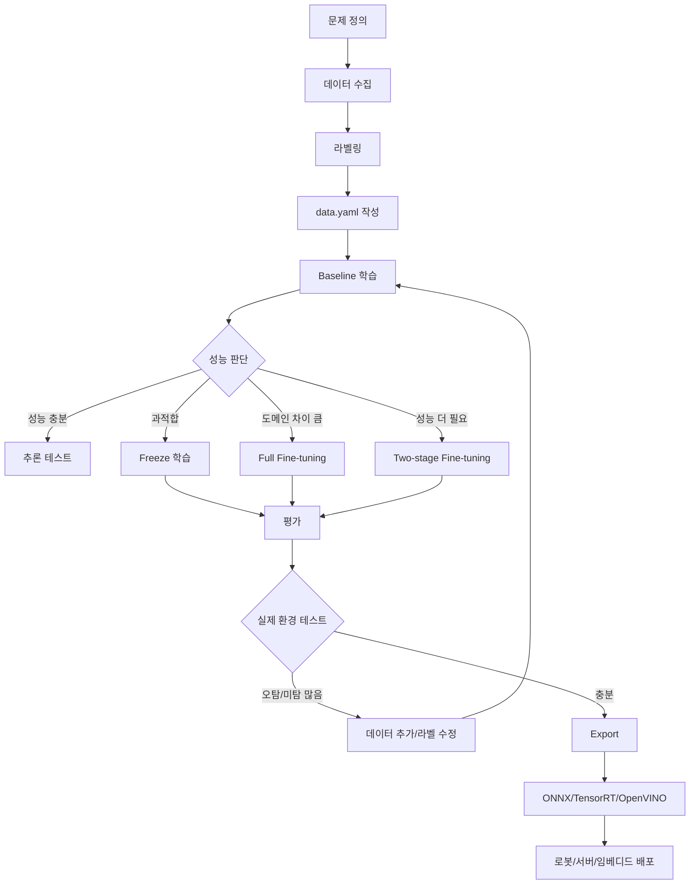

# YOLO 파인튜닝 전체 파이프라인

이 문서는 YOLO 파인튜닝을 처음 하는 사람이 실제 프로젝트까지 이어갈 수 있도록 정리한 문서 묶음이다.

핵심 목표는 다음과 같다.

```text
1. 내 데이터셋을 YOLO 형식으로 준비한다.
2. pretrained YOLO 모델로 baseline을 만든다.
3. 데이터 크기와 도메인에 따라 freeze / full fine-tuning / two-stage fine-tuning을 고른다.
4. 실험 결과를 mAP, Precision, Recall, 실제 카메라 테스트 기준으로 비교한다.
5. best.pt를 추론, ONNX, TensorRT, 임베디드/로봇 배포까지 연결한다.
```

---

## 문서 구성

```text
yolo_finetuning_pipeline_md/
├── README.md
├── 00_pipeline_overview.md
├── 01_dataset_and_labeling.md
├── 02_environment_and_install.md
├── 03_training_strategy_freeze_backbone_head.md
├── 04_experiment_management_and_metrics.md
├── 05_inference_export_deployment.md
├── 06_troubleshooting_checklist.md
└── 07_license_and_practical_policy.md
```

---

## 초보자 추천 진행 순서

처음부터 freeze, learning rate, augmentation을 다 만지면 오히려 망가질 가능성이 높다.

가장 좋은 순서는 아래다.

```text
Step 1. 데이터셋 구조 확인
Step 2. data.yaml 작성
Step 3. pretrained 모델로 baseline 학습
Step 4. freeze=10 학습 비교
Step 5. two-stage fine-tuning 비교
Step 6. val/test/실제 카메라에서 성능 확인
Step 7. best.pt export
Step 8. 배포 장비에서 FPS/정확도 확인
```

---

## 전체 파이프라인



---

## 가장 먼저 실행해볼 명령어

```bash
# 1. 설치
pip install ultralytics

# 2. 데이터셋 확인용 짧은 학습
yolo detect train \
  model=yolo26n.pt \
  data=/path/to/data.yaml \
  epochs=10 \
  imgsz=640 \
  batch=8 \
  device=0 \
  name=smoke_test

# 3. 정식 baseline
yolo detect train \
  model=yolo26n.pt \
  data=/path/to/data.yaml \
  epochs=100 \
  imgsz=640 \
  batch=16 \
  device=0 \
  name=baseline_yolo_n
```

---

## 이 문서에서 사용하는 기본 전제

이 문서는 Ultralytics YOLO CLI/Python API 기준으로 작성했다.

예시는 주로 detection 기준이다.

```text
작업: Object Detection
입력: RGB image / webcam / video
출력: bounding box + class + confidence
모델 예시: yolo26n.pt, yolo26s.pt
```

사용 중인 버전에 따라 모델 이름은 바뀔 수 있다.

예를 들어 환경에 따라 다음처럼 바꿔 쓰면 된다.

```text
yolo26n.pt  -> 최신 Ultralytics YOLO 계열 예시
yolo11n.pt  -> YOLO11 계열 사용 시
yolov8n.pt  -> YOLOv8 계열 사용 시
```

핵심 개념은 동일하다.

---

## 최종 권장 방식

처음에는 무조건 아래 3개 실험을 비교한다.

```text
1. baseline
   pretrained 모델 전체 fine-tuning

2. freeze10
   backbone 일부 freeze

3. two-stage
   stage1: freeze
   stage2: low learning rate로 전체 unfreeze
```

결과를 보고 다음 결정을 한다.

```text
데이터 적음 + 과적합      -> freeze 또는 데이터 추가
도메인 차이 큼           -> full fine-tuning
작은 객체 못 찾음         -> imgsz 증가, 라벨 품질 확인
실시간 속도 부족          -> n 모델, imgsz 감소, export 최적화
정확도 부족              -> s/m 모델, 데이터 추가, two-stage
```
